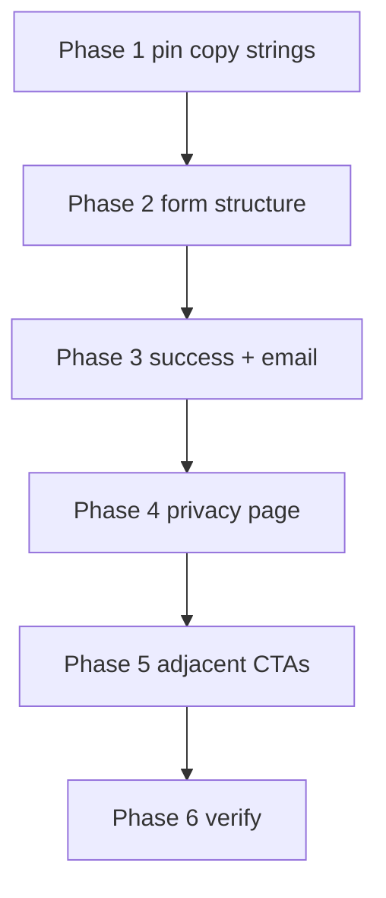

# Contact Form Copy Implementation Plan

Strict scope: **contact-form positioning, field labels/hints, trust/terms disclosure, expectation-setting, and privacy coherence**. No form schema changes, no new marketing-consent checkbox, no layout redesign beyond what the new lines require.



## Problem summary

| Issue | Current signal | Damage |
| --- | --- | --- |
| Ambiguous CTA | “Start…” headline / “send details” subtitle / “Start My…” button | Managing partner cannot tell if submit starts work, requests info, or applies |
| Absolute free claim | “100% Free” | Misleading if Google Ads spend remains the firm’s responsibility |
| Unrealistic risk reducer | “No sales call required” | Conflicts with hands-on pilot onboarding |
| Opaque fields | Website asked with no why | Feels like generic lead capture |
| No next-step promise | Trust line only | Contact details given without SLA or “no contract yet” clarity |
| Detached privacy | Tiny isolated “Privacy notice” | Not tied to the act of submitting |

**Priority correction:** position submission as a **pilot request / application**, unless work genuinely begins immediately (it does not).

## Source of truth — recommended complete copy

Implement against this block (prefer this wording where earlier bullets differ slightly):

```
Request your free 30-day pilot

Tell us about your firm and we will review your current enquiry journey before confirming the next steps.

Name
e.g. Sarah Jenkins

Firm
e.g. Smith & Partners Solicitors

Work email
sarah@smithlaw.co.uk

Firm website
smithlaw.co.uk
We use this to review your current enquiry journey.

Request My Pilot

We will review your firm and respond within one business day. Submitting this form does not start work or create a contract.

No setup or management fee during the pilot · No payment details · No long-term commitment

By submitting, you agree that Standout Group may contact you about the pilot. Privacy Notice
```

### Mapping to today’s copy keys

| UI surface | Current ([`lib/landing-copy.ts`](lib/landing-copy.ts) `reviewRequest`) | Target |
| --- | --- | --- |
| Modal heading | `Start your free 30-day pilot` | `Request your free 30-day pilot` |
| Subtitle | `Where should we send your free 30-day pilot details?` | `Tell us about your firm and we will review your current enquiry journey before confirming the next steps.` |
| Submit | `Start My Free 30-Day Pilot →` | `Request My Pilot` |
| Name label | `Your Name` | `Name` |
| Firm label | `Law Firm Name` | `Firm` |
| Email label | `Work Email` | `Work email` |
| Website label | `Your Firm's Website` | `Firm website` |
| Website hint | *(none)* | `We use this to review your current enquiry journey.` |
| Expectation line | *(none)* | `We will review your firm and respond within one business day. Submitting this form does not start work or create a contract.` |
| Trust / terms | `100% Free • No sales call required • No obligation to take it further` | `No setup or management fee during the pilot · No payment details · No long-term commitment` |
| Privacy | Isolated link `Privacy notice` | Consent sentence + linked `Privacy Notice` |

Placeholders stay as today (`e.g. Sarah Jenkins`, etc.).

### Intent notes (do not invent extra claims)

- Fee line must remain **accurate**: no setup/management fee during the pilot; advertising spend stays under the firm’s control. The recommended trust line carries the fee clarity; do **not** reintroduce “100% Free”.
- Risk reducers must **not** promise “no call / no contact”. Suitability review and response within one business day is the credible promise.
- No marketing-consent checkbox unless product also intends unrelated marketing subscription (it does not).

## Current baseline (relevant)

| Surface | File | Current behaviour |
| --- | --- | --- |
| Copy hub | [`lib/landing-copy.ts`](lib/landing-copy.ts) | All form / confirmation / privacy strings |
| Modal chrome | [`components/landing/review-request-cta.tsx`](components/landing/review-request-cta.tsx) | Renders `heading` + `subtitle`; success uses `confirmation.*` |
| Form | [`components/landing/review-request-form.tsx`](components/landing/review-request-form.tsx) | Four fields; trust line + isolated privacy link under submit |
| Field styles | [`app/globals.css`](app/globals.css) `.field`, `.request-trust-line`, `.request-privacy-line` | No field-hint pattern yet; privacy styled as tiny afterthought |
| Confirmation | `landingCopy.confirmation` | Still implies no call / no access — conflicts with request framing |
| Privacy page | [`app/privacy/page.tsx`](app/privacy/page.tsx) + `privacyPage` copy | Still framed as “Legal Enquiry Review request”, not pilot request |
| Emails | [`lib/review-request-emails.ts`](lib/review-request-emails.ts) | “Legal Enquiry Review” subject/body |
| Open CTAs | `landingCopy.cta` | Still “Start your free 30-day pilot” — same ambiguity as the form |
| Acceptance | [`scripts/final-acceptance-browser.mjs`](scripts/final-acceptance-browser.mjs) | Asserts privacy link in modal; hard-codes confirmation title |

## Out of scope

- Changing visible field set, validation rules, API payload, or honeypot
- Adding a marketing opt-in checkbox
- Redesigning modal layout, motion, or sticky dock behaviour
- Hero / trust-card / video copy (except Phase 5 open-CTA strings that feed the same modal)
- Rewriting analytics event names

---

## Phase 1 — Pin copy strings

**Goal:** Make [`lib/landing-copy.ts`](lib/landing-copy.ts) the single source for the recommended form copy before touching markup.

### Implementation

1. Update `reviewRequest.heading`, `subtitle`, `submitCta` (drop the arrow unless other primary buttons keep it for visual parity — **prefer exact recommended label** `Request My Pilot`).
2. Simplify field labels; keep placeholders.
3. Add new keys (names illustrative — match existing camelCase style):
   - `fields.website.hint` (or `websiteHint`)
   - `expectationLine`
   - `submitConsent` (sentence before the link) + keep / rename `privacyLinkLabel` → `Privacy Notice`
4. Replace `trustLine` with the recommended pilot-terms disclosure (middle dots as separators).
5. Leave `submittingCta` coherent (`Sending request…` is fine; optional `Submitting…`).

### Done when

- Diff in `landing-copy.ts` matches the recommended complete copy table above.
- No remaining `100% Free`, `No sales call`, or “Start My Free…” in `reviewRequest`.

---

## Phase 2 — Form structure (markup + light CSS)

**Goal:** Render the new information architecture so visitors see purpose → fields with context → CTA → expectation → terms → consent.

### Target order inside `.request-submit` / fields

1. Fields (website field shows hint under input, or under label as helper text)
2. Primary button
3. **Expectation line** (new)
4. **Pilot-terms / trust line** (existing slot, new copy — treat as short disclosure, not tiny reassurance)
5. **Consent + Privacy Notice** (replace isolated link-only row)

### Implementation

1. Extend `Field` in [`review-request-form.tsx`](components/landing/review-request-form.tsx) with optional `hint?: string`; wire `aria-describedby` to include hint id when present (and error id when invalid).
2. Pass website hint only on the website field.
3. Insert expectation paragraph above or directly below the button (recommended: **below button, above trust line** so the commit control is still primary).
4. Rewrite privacy row to: consent sentence + linked “Privacy Notice” (`/privacy`). Do not add a checkbox.
5. CSS in [`app/globals.css`](app/globals.css):
   - `.field-hint` — muted, smaller than label, readable (≥ ~0.8125rem), not decoration-only
   - Expectation line — clear body-adjacent size; not smaller than privacy
   - Trust line — readable disclosure; avoid shrinking further to compensate for length
   - Privacy/consent line — same visual band as expectation/trust (connected to submit), not an orphan footnote

### Accessibility

- Hint and expectation are plain text (not `title` tooltips).
- Consent link remains keyboard-focusable with existing focus-visible styles.
- Do not hide critical terms behind icons alone (lock icon may stay decorative).

### Done when

- Modal shows all recommended lines in order; website hint only on that field.
- Privacy is grammatically part of submission, not a lone link.

---

## Phase 3 — Success state + email coherence

**Goal:** After submit, the same story holds: request received, review, respond soon, nothing activated yet.

### Current conflict

`confirmation.body`: *“You do not need to book a call or provide access to anything.”* — clashes with a hands-on pilot that will need discussion after suitability review.

### Implementation

1. Update `landingCopy.confirmation`:
   - Keep heading close to today if acceptance depends on it, **or** update acceptance in Phase 6 — prefer coherent copy, e.g. retain *“Your pilot request has been received.”*
   - Body aligned with expectation line, e.g. review firm / respond within one business day / submission did not start work or create a contract.
2. Align [`lib/review-request-emails.ts`](lib/review-request-emails.ts) subject/body with **pilot request** language (not only “Legal Enquiry Review”) and the same SLA / non-contract clarification where appropriate.
3. If `siteConfig.reviewDeliveryTiming` is set later, ensure it does not contradict “within one business day”.

### Done when

- Success modal and auto-reply do not promise “no call” or imply work has started.

---

## Phase 4 — Privacy notice page

**Goal:** Privacy policy coherent with the updated offer and form consent line.

### Implementation

1. In `landingCopy.privacyPage`:
   - Intro / `collectBody`: purpose = reviewing suitability for the **free 30-day pilot** / communicating about **this pilot request** (not only “deliver a public-facing Legal Enquiry Review” unless that remains the literal product name — prefer language that matches the live page offer).
   - Clarify contact is about the pilot request (matches consent sentence); still no unrelated marketing subscription claim.
2. Confirm [`app/privacy/page.tsx`](app/privacy/page.tsx) still renders sections from copy + `siteConfig` (lawful basis / retention remain config-gated launch blockers — do not fake values here).
3. Metadata description on the privacy route: align wording with pilot request if it still says only “Legal Enquiry Review request form”.

### Done when

- A solicitor reading `/privacy` after the form consent line sees the same purpose, data types, and contact scope.

---

## Phase 5 — Adjacent open-CTA consistency

**Goal:** Buttons that open the modal should not say “Start” while the modal says “Request”.

### Implementation

1. Update `landingCopy.cta.label`, `mobileLabel`, and optionally `microcopy` / `afterVideoCue` to **request** framing (e.g. label `Request your free 30-day pilot`, mobile `Request My Pilot →` or equivalent short form).
2. Keep `aria-label="Request a pilot"` on sections if already accurate.
3. Do **not** broaden into hero supporting copy in this phase unless a single phrase still says submission “starts” the pilot in a contractual sense — only fix clear CTA contradictions.

### Done when

- Desktop final CTA, sticky mobile CTA, and modal heading all read as the same action: request a pilot.

---

## Phase 6 — Verify

**Goal:** Confirm copy, a11y, and automated checks match the new contract with the visitor.

### Checks

1. Open modal (desktop + mobile fullscreen): scan for leftover “Start My Free”, “100% Free”, “No sales call”.
2. Confirm website hint + expectation + consent visible without horizontal overflow; trust line wraps cleanly.
3. Keyboard: tab through fields → submit → privacy link; screen-reader: hint associated via `aria-describedby`.
4. Submit success path: confirmation body matches non-activation promise.
5. `/privacy` reads coherent with consent sentence.
6. Update [`scripts/final-acceptance-browser.mjs`](scripts/final-acceptance-browser.mjs) if it hard-codes old confirmation title or assumes link-only privacy chrome.
7. Spot-check [`scripts/check-copy-audit.mjs`](scripts/check-copy-audit.mjs) — add a warning/blocker for `100% Free` / `No sales call required` if useful as a regression guard.

### Done when

- Manual modal pass + acceptance script green for privacy-in-modal and success copy.
- No out-of-scope files changed.

---

## Suggested implementation order

| Phase | Effort | Risk if skipped |
| --- | --- | --- |
| 1 Pin copy | Low | Markup drifts from approved wording |
| 2 Form structure | Medium | Longer terms stay unreadable / privacy stays detached |
| 3 Success + email | Low–medium | Post-submit story contradicts the form |
| 4 Privacy page | Medium | Consent line points at an outdated notice |
| 5 Adjacent CTAs | Low | Entry CTA still implies instant start |
| 6 Verify | Low | Regressions in acceptance / a11y |

**Do not code until this plan is approved.** On approval, implement phases in order; keep changes copy-first with minimal CSS for the new hint / expectation / consent hierarchy.
