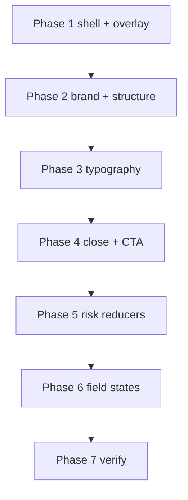

# Contact Form Design Implementation Plan

Strict scope: **modal chrome, layout geometry, typography hierarchy, field visual states, close/CTA prominence, brand cue, and risk-reducer presentation**. Prefer CSS + light markup in the existing modal/form components. Do not invent new form fields, validation rules, or API behaviour.

**Coordinate with** [`.cursor/plans/contact-form-copy-implementation.md`](contact-form-copy-implementation.md): that plan owns wording (request framing, expectation line, consent sentence). This plan owns how that content is sized, spaced, and composed. Where both touch the trust/risk block, implement the **stacked presentation** here and pull final strings from the copy plan once approved — interim design can use the risk-reducer examples below.



## Problem summary

| Issue | Current signal | Damage |
| --- | --- | --- |
| Excess height | ≤479px: `height: 100dvh` fullscreen takeover; panel stretches with empty lower half | Looks unfinished; form feels heavier than it is |
| Narrow mobile card | Mid-mobile `min(100% - 1rem, …)`; small phones go edge-to-edge instead of a modern inset card | Either cramped side margins or a wall of empty white |
| Flat hierarchy | Title / subtitle / labels / disclosures sit in a narrow size band | Hard to scan; microcopy reads defensive |
| Overloaded trust row | Single tiny line + lock icon packing three claims | Illegible at mobile width; weak reassurance |
| Loud close control | Close competes visually with the primary action | Dilutes decisiveness of submit |
| No brand in modal | Generic white dialog once overlay opens | Loses Standout Group context from the page |
| Muddy backdrop | Slate overlay can read olive-brown against page colour | Feels accidental vs intentional focus |
| Flat inputs | Pale `#e2e8f0` borders on near-white fill | Fields barely separate from the panel |
| Soft CTA | Long label + arrow; button not especially tall | Reads as generic marketing CTA |
| Loose structure | Header chrome vs body; trust/privacy as afterthoughts | Feels like a lead popup, not the last step of an offer |

## Target composition (mobile)

Top → bottom inside the white panel:

1. Small Standout Group mark (wordmark or purple device)
2. Headline
3. Two-line explanation
4. Four fields
5. Primary button — **Request My Pilot**
6. Defined next-step / expectation message (from copy plan when available)
7. Three concise risk reducers (stacked)
8. Submission / privacy disclosure

The panel uses **`height: auto`** (max-height with scroll only if content exceeds viewport). Prefer a **compact centred modal** with ~16–20px screen margins over a bottom sheet unless keyboard occlusion forces a sheet later.

### Mobile geometry targets

```css
/* Intent — exact selectors live on .review-modal */
width: calc(100% - 32px);
max-width: 440px;
height: auto;
max-height: min(92dvh, calc(100% - 32px)); /* scroll body only if needed */
```

### Overlay target

```css
background: rgba(15, 12, 22, 0.72);
backdrop-filter: blur(4px);
-webkit-backdrop-filter: blur(4px);
```

### Typography targets

| Role | Size | Weight / contrast |
| --- | --- | --- |
| Heading | 20–22px | Semibold (600–650); avoid overpowering the brand mark |
| Supporting text | 14–15px | Readable slate (not pale grey) |
| Labels | 13–14px | Medium |
| Input text | ≥16px on mobile | Prevents iOS zoom; keep desktop ≥16px or match system |
| Disclosures / risk / privacy | 12–13px | Sufficient contrast — reassuring, not legal-micro |

### Risk-reducer presentation (design)

Replace the single compressed row. Under the button, use two or three short items that wrap naturally — e.g.:

```
✓ No payment details
✓ No long-term commitment
✓ Nothing goes live without approval
```

Keep compact, not microscopic. Final wording may align with the copy plan’s fee/commitment language (no “100% Free”, no “no sales call”). Checkmarks are decorative (`aria-hidden`); the list text remains the accessible content. Drop the lock icon.

### CTA

- Label: **Request My Pilot** (no arrow unless the design system requires parity elsewhere — prefer no arrow in-modal)
- Height ~48–52px, full width of the form column
- Strong `:focus-visible`; no decorative drop shadow unless other primary buttons already use one consistently

### Close control

- ~40–44px tap target
- Visually light icon (thinner stroke / quieter colour)
- No heavy border, padded pill, or boxed container that rivals the CTA
- Keep `aria-label="Close"` and clear focus ring

## Current baseline (relevant)

| Surface | File | Current behaviour |
| --- | --- | --- |
| Modal shell | [`components/landing/review-request-cta.tsx`](components/landing/review-request-cta.tsx) | `<dialog class="review-modal">` + header/title/subtitle/close + body |
| Form | [`components/landing/review-request-form.tsx`](components/landing/review-request-form.tsx) | Four fields; trust line + lock; isolated privacy link |
| Modal / form CSS | [`app/globals.css`](app/globals.css) `/* Phase 6: CTA modal + form */` | Desktop ~600px card; ≤479px **fullscreen** `100dvh`; backdrop slate-900/60 + blur 12px |
| Field CSS | [`.field`](app/globals.css) | Border `#e2e8f0`; focus plum + 4px soft ring; errors exist |
| Brand mark | [`components/landing/hero.tsx`](components/landing/hero.tsx) + [`.brand-mark*`](app/globals.css) | “Standout **Group**” wordmark with accent on Group — reuse scaled-down pattern |
| Copy hub | [`lib/landing-copy.ts`](lib/landing-copy.ts) | Trust line still one compressed string; CTA still long “Start…” label |
| Acceptance / screenshots | [`scripts/`](scripts/), `ops/phase-6-screenshots/` | May assume fullscreen mobile modal |

## Out of scope

- Rewriting offer/privacy/email narrative beyond strings needed for layout (owned by copy plan)
- New fields, honeypot, schema, or API payload
- Sticky dock / page CTA redesign (except modal open chrome)
- Bottom-sheet gesture dismiss / drag handle (only consider if centred auto-height fails with keyboard)
- Desktop max-width overhaul beyond keeping a sensible centred card (≤440px mobile target; desktop may stay ~600px or tighten slightly for consistency — decide in Phase 1, prefer minimal desktop churn)

---

## Phase 1 — Shell geometry + overlay

**Goal:** Kill the empty lower half and muddy backdrop. Modal becomes a compact content-sized card on all breakpoints.

### Implementation

1. In [`app/globals.css`](app/globals.css):
   - Remove / override the `@media (max-width: 479px)` fullscreen rules (`height: 100%` / `100dvh`, zero radius, full width).
   - Set `.review-modal` to `height: auto` (and `.review-modal-panel` accordingly — no flex-grow empty region).
   - Mobile width: `calc(100% - 32px)` with `max-width: 440px`; vertical margin so the card centres with ~16–20px breathing room; keep safe-area padding on body.
   - Cap with `max-height` + keep overflow on `.review-modal-body` only when content exceeds the viewport (keyboard + long error summary).
   - Update `.review-modal::backdrop` to `rgba(15, 12, 22, 0.72)` and `blur(4px)`.
2. Confirm `<dialog>` centring still works (`margin: auto` / browser default) after dropping fullscreen.
3. Desktop: keep centred card; retain or slightly reduce max-width so success + form states never force a tall empty panel (`max-height` on panel, not forced min-height).

### Decision locked in this phase

- **Centred compact modal** (not bottom sheet) as the default mobile pattern.
- Revisit bottom sheet only if Phase 7 shows serious keyboard occlusion on small phones.

### Done when

- On a short form (no errors), the white panel hugs content — no large empty band.
- Side margins ≈16px; card feels near full usable width up to 440px.
- Backdrop reads as intentional dark purple-neutral, not olive/brown.

---

## Phase 2 — Brand mark + visual structure

**Goal:** One recognisable Standout Group cue and a single top-to-bottom reading order that matches the target composition.

### Implementation

1. In [`review-request-cta.tsx`](components/landing/review-request-cta.tsx) header (or immediately above the title):
   - Add a restrained mark: reuse the hero wordmark pattern at a **smaller** size (e.g. ~14–16px / compact tracking), or a small purple brand device + “Standout Group” text.
   - Do **not** add a banner, logo bar, or pilot-summary strip — one element only.
2. Ensure heading remains the primary text signal after the mark (mark < heading in visual weight).
3. Align form footer order in [`review-request-form.tsx`](components/landing/review-request-form.tsx) with:
   - Submit → expectation/next-step (slot for copy plan) → risk reducers → privacy/consent
4. Tighten header/body padding so the composition feels continuous (optional: soften or remove the header bottom border if it splits mark+title from the form awkwardly).

### Done when

- Opening the modal still feels like Standout Group without a heavy branded chrome.
- Vertical order matches the target composition list.

---

## Phase 3 — Typography hierarchy

**Goal:** Distinct size/weight steps so the form scans as offer → action → fine print.

### Implementation

1. Update [`.review-modal-title`](app/globals.css), [`.review-modal-subtitle`](app/globals.css), [`.field label`](app/globals.css), inputs, trust/privacy/expectation classes to the target scale.
2. Raise disclosure contrast (move off pale slate-500 where text is meaningful reassurance).
3. Keep input `font-size` at least `1rem` (16px) on mobile.
4. If the copy plan’s expectation line is not yet present, style a placeholder class so Phase 5/copy can drop in without another type pass.

### Done when

- Heading, support, labels, inputs, and disclosures are visually distinguishable at a glance on a 390px viewport.

---

## Phase 4 — Close control + CTA prominence

**Goal:** Submit is the only decisive control; close stays accessible but quiet.

### Implementation

1. `.review-modal-close`: fixed ~40–44px hit area; lighter icon colour/stroke; transparent background; no competing border/box. Preserve focus-visible outline.
2. `.request-submit-btn` / related:
   - Label from copy: **Request My Pilot** (update `landingCopy.reviewRequest.submitCta` if not already done by copy plan).
   - Min-height ~48–52px; full width; strong focus-visible.
   - No extra decorative shadow unless `.btn-primary` already uses one site-wide.
3. Remove in-modal arrow from the submit label if present.

### Done when

- Close never draws equal attention to the purple CTA.
- CTA reads short and decisive at ~50px tall.

---

## Phase 5 — Risk reducers

**Goal:** Replace the illegible single-line trust row with compact stacked reassurance.

### Implementation

1. Change markup: list or stacked paragraphs under the button (and under expectation line if present).
2. CSS: `.request-trust-list` (name illustrative) — 12–13px, good contrast, comfortable line-height, optional check marks as decorative spans.
3. Allow natural wrap; do not force one horizontal row with middle dots at mobile width.
4. Remove lock SVG.
5. Wire strings via `landing-copy.ts` (array of three short items preferred over one concatenated string).

### Copy note

Prefer accurate pilot terms from the copy plan when available. Design examples above are structural placeholders — do not ship misleading “100% Free” / “no sales call” claims.

### Done when

- Three short items read clearly on a 320–390px width without feeling microscopic.

---

## Phase 6 — Input states

**Goal:** Fields clearly belong to a form; focus and errors are obvious without relying on border colour alone.

### Implementation

1. Default border: slightly darker neutral than `#e2e8f0` (e.g. slate-300 range).
2. Focus: clear purple/plum focus ring (keep or slightly strengthen existing `box-shadow` ring); visible border change.
3. Error: keep `.field-error` text beneath the field + summary; ensure error text remains visible when border alone would be insufficient (colour-blind / forced-colors: keep text).
4. Confirm attributes in [`review-request-form.tsx`](components/landing/review-request-form.tsx):
   - Email: `type="email"`, `autoComplete` from copy, email keyboard
   - Website: `inputMode="url"` (already); consider `type="url"` only if validation accepts values without `https://` — if not, keep `type="text"` + `inputMode="url"` and document why
   - Name / firm: sensible `autoComplete` values already in copy
5. Spot-check placeholder contrast remains secondary to typed input text.

### Done when

- Default, focus, and error states are distinct; errors announce in text under fields; mobile keyboards match email/url intent.

---

## Phase 7 — Verify

**Goal:** Confirm the modal feels like the final step of the offer on real devices/viewports.

### Checks

1. **375 / 390 / 430 width:** card uses ~16px margins, `max-width` 440px, height hugs content; no fullscreen empty panel.
2. **Keyboard open (iOS/Android):** focused field remains usable; body scrolls inside max-height if needed.
3. **Desktop:** centred card, overlay correct colour/blur, close vs CTA hierarchy.
4. **Success state:** confirmation content still fits auto-height layout; focus moves to success as today.
5. **A11y:** tab order mark/title → fields → submit → links → close; close still labelled; risk items not icon-only; focus rings visible on CTA, close, inputs, privacy link.
6. **Brand:** mark visible but does not overpower headline.
7. Update acceptance / screenshot flows if they assert fullscreen mobile modal dimensions or old trust-line DOM (lock icon, single `.request-trust-line` string).

### Done when

- Manual pass on mobile + desktop matches the ten design intents; no regressions to submit/analytics behaviour.

---

## Suggested implementation order

| Phase | Effort | Risk if skipped |
| --- | --- | --- |
| 1 Shell + overlay | Medium | Empty panel + muddy backdrop remain the dominant impression |
| 2 Brand + structure | Medium | Still feels like a generic popup |
| 3 Typography | Low–medium | Hierarchy stays flat even with better layout |
| 4 Close + CTA | Low | Competing actions / soft submit |
| 5 Risk reducers | Medium | Reassurance stays illegible |
| 6 Field states | Low–medium | Form still feels unfinished / hard to correct |
| 7 Verify | Low | Keyboard / success / acceptance regressions |

**Do not code until this plan is approved.** On approval, implement phases in order; keep desktop changes minimal unless required for shared selectors. Prefer CSS-first fixes in `globals.css`, with markup changes limited to brand mark, trust list structure, and CTA/close refinements.
