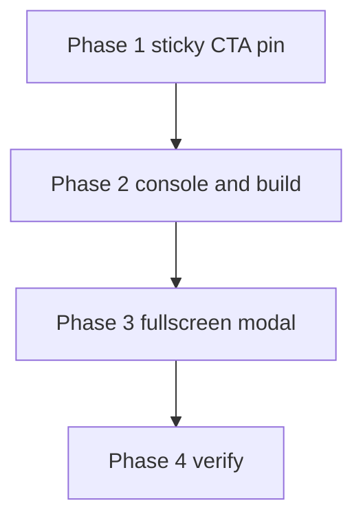

# Final Copy Changes Implementation Plan

Strict scope: **only the three fixes below**. No copy rewrites, no motion/visual redesign, no layout refactors beyond what these items require.

## Current baseline (relevant)

| Surface | File | Current behaviour / state |
| --- | --- | --- |
| Sticky dock | [`components/landing/review-request-cta.tsx`](components/landing/review-request-cta.tsx) `MobileStickyCta` | Unlocks near `#video`; hides when `#final-cta` or `.site-footer` intersect, with `rootMargin: "0px 0px 96px 0px"` |
| Inline CTA | same file `ReviewRequestCta` | `#final-cta` is `hidden md:block` — not visible on mobile, yet still observed for suppression |
| Page order | [`app/page.tsx`](app/page.tsx) | hero → bridge → video → trust → `#final-cta` → sticky dock; footer after `</main>` |
| Video assets | [`public/video/`](public/video/), [`scripts/check-video-assets.mjs`](scripts/check-video-assets.mjs) | Captions present; **MP4 + poster missing** → launch blockers + console/media noise |
| Launch gate | [`ops/launch-readiness.json`](ops/launch-readiness.json) | `launch_ready: false`; blockers list missing MP4 + poster |
| Modal | [`app/globals.css`](app/globals.css) `.review-modal` | Centered card with inset width + radius at all breakpoints; `@media (max-width: 639px)` still leaves margin and rounded card |

## Out of scope (do not change)

- Landing copy strings in [`lib/landing-copy.ts`](lib/landing-copy.ts) (labels, H1, trust bullets, etc.)
- Hero, trust-card, or motion styling unrelated to the three fixes
- Desktop modal treatment above the small-viewport breakpoint
- Sticky dock visual redesign (colours, blur, button styling) beyond visibility logic / clearance coupling
- Analytics event names or form field schema

---

## Phase 1 — Sticky CTA stays put

**Goal:** The mobile sticky bar remains visible for the whole scroll after unlock, except inside a **small clearance zone** around an equivalent on-screen CTA or the footer — not when the visitor merely reaches the trust bullets.

### The rule (pin this; implement exactly)

| State | Sticky dock |
| --- | --- |
| Above unlock (before video engagement) | Hidden (existing unlock behaviour — keep) |
| Between unlock and clearance zone | **Visible** — including through video, trust bullets, and methodology |
| Clearance zone: equivalent in-page CTA on screen | Hidden (avoid double CTA) |
| Clearance zone: footer on screen | Hidden (avoid covering footer) |
| Modal open | Hidden (existing `html.modal-open` rule — keep) |

“Equivalent CTA” = the in-page primary trial button (`#final-cta` / “Start Free 30-Day …” control), **only when that control is actually visible**. On mobile today `#final-cta` is `hidden md:block`, so it must **not** count as a clearance target while display-none.

### Likely cause

`useStickyCtaSuppressed` observes `#final-cta` and `.site-footer` with a **96px bottom `rootMargin`**. On mobile the inline CTA is hidden, so the page ends soon after trust; the footer enters the expanded intersection root while the visitor is still reading trust — the dock drops out mid-conviction.

### Implementation (touch only what’s needed)

1. **Rewrite suppression targeting** in `useStickyCtaSuppressed` ([`review-request-cta.tsx`](components/landing/review-request-cta.tsx)):
   - Observe `.site-footer` always.
   - Observe `#final-cta` only when it is a real on-screen peer (visible / not `display: none`), **or** drop it from the mobile observer set entirely and rely on footer-only clearance on small viewports.
   - Tighten `rootMargin` to a **small** clearance (dock height + modest buffer — roughly matching `--mobile-sticky-cta-height`, not a large early-hide band). Prefer “hide when landmark is about to be covered,” not “hide a screen early.”
2. Keep unlock logic (`useStickyCtaUnlocked`) unchanged unless testing proves it interacts with the false hide.
3. Keep `sticky-cta-clearance` class toggling tied to actual visibility so footer gap still collapses when the dock is hidden.
4. Update comments above `useStickyCtaSuppressed` / `MobileStickyCta` so they state the pinned rule, not the old “hide as footer approaches with large margin” wording.
5. Acceptance ([`scripts/final-acceptance-browser.mjs`](scripts/final-acceptance-browser.mjs)): add or adjust a check that, after unlock and while scrolled through the trust section (before footer clearance), `.mobile-sticky-cta-wrapper` has `is-visible`. Do not change unrelated acceptance assertions.

### Manual test (required)

On a ~390×844 viewport, scroll the full page **slowly**:

1. Dock absent at top → appears after video engagement.
2. Remains visible through video, trust bullets, and methodology.
3. Hides only in the deliberate clearance zone at the footer (and at `#final-cta` on viewports where that button is visible).
4. Reappears if scrolling back up out of the clearance zone.

**Done when:** Mid-page trust reading no longer drops the dock; clearance is only at equivalent CTA / footer.

---

## Phase 2 — Console errors / flagged build issue

**Goal:** Clear each console and Next.js overlay item individually. Prioritize anything that throws (or fails) in a production build over dev-only warnings. Start with the missing video asset — it is the known launch blocker and a common source of media console noise.

### Known starting points

| Priority | Item | Evidence |
| --- | --- | --- |
| P0 | Missing `public/video/legal-enquiry-review.mp4` | [`ops/launch-readiness.json`](ops/launch-readiness.json) blocker; [`check-video-assets.mjs`](scripts/check-video-assets.mjs) fails when `VERCEL_ENV=production` / `REQUIRE_VIDEO_ASSETS=1` |
| P0 | Missing `public/video/legal-enquiry-review-poster.webp` | Same |
| P1 | Any runtime React / Next overlay errors after assets are present | Discover in browser console on `npm run dev` / production-like preview |
| P2 | Remaining dev-only warnings | Fix only if cheap and in-scope; do not chase unrelated lint noise |

### Implementation

1. **Video assets first**
   - Add the final MP4 + poster under [`public/video/`](public/video/) per [`public/video/README.md`](public/video/README.md) (captions already present).
   - If final media is not in-repo yet: document the blocker clearly and stop short of inventing placeholder binaries that fake production readiness — but still clear any *code* paths that throw when assets are absent (placeholder path should degrade without console spam).
   - Re-run `npm run check:video` and refresh launch readiness (`npm run check:launch` / copy-audit) so blockers update.
2. **Open console + Next overlay** on mobile and desktop widths; inventory every error/warning.
3. **Resolve each item** in priority order (production-throwing → overlay errors → noisy warnings). Stay inside files already implicated by those errors — do not drive-by refactor.
4. Re-check after the video fix: confirm whether media 404s / player errors disappeared before changing unrelated code.

**Done when:** Production asset check is clean (or remaining gaps are explicitly external media delivery, not code), and the overlay/console has no unresolved production-relevant errors for this page.

---

## Phase 3 — Modal fills the screen on small mobile

**Goal:** Below a small viewport breakpoint (~`<480px`), the enquiry modal is a full-screen takeover: **100% width and height**, no visible margin, no floating rounded card over the page background.

### Current vs target

| | Current (`globals.css`) | Target `<480px` |
| --- | --- | --- |
| Width | `min(100% - 1rem/1.25rem, 37.5rem)` | `100%` |
| Height | `max-height: 94dvh` / `92dvh` | `100%` / `100dvh` (full viewport, safe-area aware) |
| Radius | `var(--radius-large)` / `1rem` | `0` (no floating card) |
| Margin | `margin: auto` with inset | Flush to edges |
| Backdrop peek | Visible above/below card | No page chrome peeking around the panel |

### Implementation

1. In [`app/globals.css`](app/globals.css), add a dedicated `@media (max-width: 479px)` (or equivalent ~480px) block for `.review-modal` / `.review-modal-panel`:
   - `width: 100%`; `height: 100%` / `100dvh`; `max-height: 100dvh` (account for `env(safe-area-inset-*)` on padding, not by shrinking into a floating card).
   - `margin: 0`; `border-radius: 0`; remove card-like shadow if it reads as a floating layer.
   - Panel + body still scroll internally if the form exceeds the viewport (`overflow-y: auto` on `.review-modal-body` — keep).
2. Leave **≥480px** (and current `640px` polish) as the centered-card treatment — do not restyle desktop/tablet modal beyond what’s required to avoid cascade conflicts.
3. Confirm [`review-request-cta.tsx`](components/landing/review-request-cta.tsx) dialog markup does not need structural changes; prefer CSS-only.
4. When open: sticky dock already hides via `html.modal-open` — verify that still holds on full-screen mobile.

### Manual test

- **390px width:** open from sticky CTA → modal edge-to-edge, no side/top/bottom gap, no rounded floating card.
- **≥480px (e.g. 640 / desktop):** still centered card as today.
- Escape / close / focus return still work (existing acceptance paths).

**Done when:** Small phones get a full-screen form takeover; larger viewports unchanged.

---

## Phase 4 — Verify (no further product changes)

Run through once after Phases 1–3:

1. **Sticky:** slow full-page scroll on mobile — present everywhere except deliberate CTA/footer clearance.
2. **Console / build:** clean of production-relevant errors; video check / launch readiness reflects asset reality.
3. **Modal:** full-screen below ~480px; card treatment above.
4. **Scope audit:** `git diff` touches only files required for these three fixes (plus acceptance assertions tied to them). Revert any accidental copy, motion, or layout drive-bys.

**Done when:** All three goals pass and the diff stays strictly in scope.
