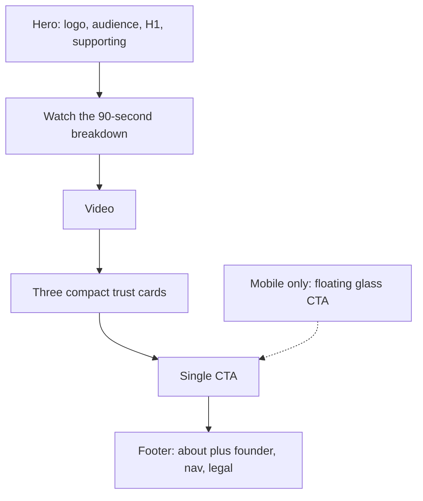

# Landing page: quieter, one CTA, brand-true

The page is currently trying to convert in three places at once: a founder paragraph, a checklist, two CTA blocks, and three full-width trust cards. That is why it feels busy. The conversion path should be **headline → video → three compact trust cards → one button**. Everything else belongs in the footer or goes away.

## What is wrong now

- **Two desktop CTAs.** `[app/page.tsx](app/page.tsx)` renders `#after-video-cta` (always visible) and `#final-cta` (desktop-only). That is the duplicate you are seeing.
- **The sticky dock is a beige panel, not a button.** `[MobileStickyCta](components/landing/review-request-cta.tsx)` wraps checkmarks + a pink rectangle in an ivory bar. It reads as a second UI chrome, not a CTA.
- **Pink is the loudest colour on the page.** `--color-cta: #b33d98` plus a magenta glow on the featured trust card fights the Standout Group wordmark purple (`#53308a`) on the main site screenshot.
- **Founder copy sits in the conversion path.** The Alex paragraph is between video and CTA, so it competes with the ask instead of supporting brand trust.

## Recommended page structure

Keep, in this order:

1. Logo, “Exclusively for UK law firms”, headline, supporting line
2. “Watch the 90-second breakdown”
3. Video (the conversion engine — give it more air)
4. Three compact trust cards
5. One CTA
6. Footer

Remove from the main column:

- Founder Alex paragraph
- “No system access / No sales pitch / Quantified recommendations”
- The second CTA
- The “Ready when you are…” cue after the video
- The “No obligation” badge and featured/pink treatment on the trial card

## Founder copy → footer About

Move `[landingCopy.founderStory](lib/landing-copy.ts)` into the footer brand column in `[components/landing/footer.tsx](components/landing/footer.tsx)`, under the existing about line.

Keep the current about sentence (what the firm does). Add the founder paragraph as the second, quieter line. It should feel like provenance, not a mid-page bio. Do not add an “About” modal unless you later want it — the footer already has the right home for this.

## Trust cards: smaller modules, above the CTA

Treat the three reassurance cards as **compact modules**, not sales panels. Same three ideas, less copy and less chrome.

- **Order:** video → cards → CTA (cards never sit below a button).
- **Size:** icon + short title + one tight line. Drop the second sentence on each card.
- **Equal weight:** no featured card, no badge, no magenta left border, no lift.
- **Shape:** slightly rounder (12–16px), still the cream paper on navy so they match the brand site cards — just smaller and quieter.
- **Desktop:** three columns, shorter height. **Mobile:** still stacked, but compact enough that the sticky button does not fight them.

Suggested tightened lines (can be edited before build):

- Spend time on qualified, serious enquiries — free consults for real intent, not time-wasters.
- Serious prospects prevented from going cold — a clear next step, not an inbox.
- 30-day free trial — continue only after you see live results.

If you want them even quieter, titles only. I would keep one short line: law-firm buyers still need a reason, they just should not have to read a paragraph.

## One CTA, easy to hit

**Desktop:** one in-page button under the trust cards. No sticky. No second block.

**Mobile:** one floating button, not a beige dock.

- Hide the in-page CTA on small screens (sticky owns the tap).
- Hide the sticky when the footer is in view, so it does not cover legal links.
- Strip all surrounding copy: no checklist, no cue, no ivory tray. Button only, inset from the screen edges, with safe-area padding.

## Button: rounder, glass, brand purple — no pink

Replace magenta `#b33d98` with Standout Group purple (`#53308a` / a slightly lighter sibling on navy for contrast). Keep white label text so it stays readable.

Do **not** do a fully transparent glass pill — that fails contrast on a dark page. Use a hybrid that still reads as glass:

- Pill radius (fully rounded ends), not 4px boxes
- Brand-purple fill at high opacity, 1px light rim, light inner highlight, `backdrop-filter` blur
- Soft purple glow, not magenta
- Hover: lift 2px, rim brightens, arrow shifts, glow slightly stronger, ~180ms ease
- Respect `prefers-reduced-motion` (colour change only)

Same visual language for the sticky mobile button so it feels like one control, not two products.

Leave the booking modal submit button aligned to the same purple so pink does not reappear inside the form.

## Colour and polish (professional, law-firm)

- **Keep:** navy theatre, cream paper, serif headline, wordmark (white + brand purple “Group”).
- **Retire as a conversion colour:** `--color-cta` magenta, magenta card glow, pink hover.
- **Use plum/lavender only as whisper accents** (audience underline, play control), never as the primary button.
- Tighten vertical rhythm: more space around the video, less between trust cards and CTA, less gap above the footer once the founder block is gone.
- The entire page should feature modern 2026 website design elements, similar to Apple.com's website [style. It should have micro animations when the visitor interacts with it.](http://style.It)

Hero copy stays. It is the hook; it is not the clutter.

## Files this would touch (when you say go)

- `[app/page.tsx](app/page.tsx)` — single CTA, founder off the page
- `[components/landing/review-request-cta.tsx](components/landing/review-request-cta.tsx)` — strip microcopy; restyle sticky as a floating pill
- `[components/landing/reassurance-block.tsx](components/landing/reassurance-block.tsx)` + `[app/globals.css](app/globals.css)` — compact equal cards; glass CTA; no pink tokens
- `[components/landing/footer.tsx](components/landing/footer.tsx)` + `[lib/landing-copy.ts](lib/landing-copy.ts)` — founder in About; drop unused microcopy

No new sections, no extra motion language, no second conversion idea. The video and the headline do the work; the cards reassure; the button is the only ask.