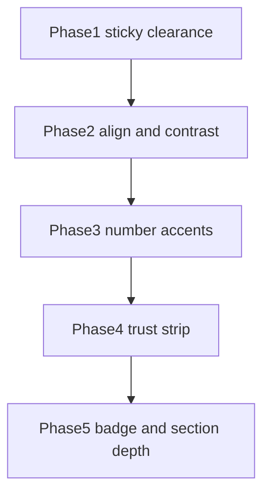

# Mobile Optimisation

Strict constraints for every phase: **no copy changes** (span wraps only), **desktop untouched** (`md:` / `lg:` restores), **video section ignored**.

## Current baseline (relevant)

| Surface                       | File                                                                                                                      | Notes                                                                        |
| ----------------------------- | ------------------------------------------------------------------------------------------------------------------------- | ---------------------------------------------------------------------------- |
| Page shell + sticky clearance | `[app/page.tsx](app/page.tsx)`, `[.page-shell](app/globals.css)`                                                          | Already `pb-28` / `7rem`; footer has sticky-clear padding                    |
| Hero + audience               | `[components/landing/hero.tsx](components/landing/hero.tsx)`, `[.hero-*](app/globals.css)`                                | Supporting already `text-left md:text-center`; audience already a soft badge |
| Bridge lead-in                | `[app/page.tsx](app/page.tsx)` L32                                                                                        | Already left on mobile / center on `md:`                                     |
| Trust cards                   | `[components/landing/reassurance-block.tsx](components/landing/reassurance-block.tsx)`, `[.trust-grid*](app/globals.css)` | Mobile vertical stack; desktop 3-col                                         |
| Sticky CTA                    | `[MobileStickyCta](components/landing/review-request-cta.tsx)`                                                            | Do not restyle the dock; only clear content beneath it                       |
| Copy source                   | `[lib/landing-copy.ts](lib/landing-copy.ts)`                                                                              | **Do not edit strings**                                                      |

Accent default for Phase 3: brand plum `--color-accent` (`#3b2c4d`) via `text-[var(--color-accent)] font-extrabold` so highlights match CTAs instead of introducing emerald.

---

## Phase 1 — Sticky CTA occlusion

**Goal:** Last trust card + footer copyright fully scroll past the sticky dock on mobile.

**Changes:**

- In `[app/page.tsx](app/page.tsx)`: bump `<main>` and `.page-shell` from `pb-28` → `pb-36`, keep `md:pb-0` / `md:pb-12`.
- In `[app/globals.css](app/globals.css)`: align `.page-shell` mobile `padding-block` bottom with ~9rem (`pb-36`); leave `md:` block at `3rem`.
- If footer still clips after shell bump, increase `.site-footer` mobile bottom padding only (keep `md:` padding unchanged).

**Out of scope:** Sticky CTA component markup, video section.

**Verify:** Mobile scroll — copyright clears dock; desktop padding unchanged.

---

## Phase 2 — Alignment fatigue and contrast

**Goal:** Left-aligned readable body on mobile; AA-dark slate body color.

**Changes:**

- Confirm (already present) on supporting + bridge: `text-left md:text-center`. Keep headline + audience/badge centered.
- Raise body contrast: Tailwind on supporting/bridge from `text-slate-700` → `text-slate-800` (or `text-slate-900`).
- Mirror in CSS so utilities and stylesheet agree: `.hero-supporting` and `.video-bridge` color `#334155` → `#1e293b` (`slate-800`); leave `.hero-title` / centered desktop rules as-is.

**Out of scope:** Rewording any strings; video container.

---

## Phase 3 — Highlight key numbers

**Goal:** Emphasize `£1 million` and `seven figures` without changing wording.

**Changes (JSX only in `[components/landing/hero.tsx](components/landing/hero.tsx)`):**

- Render `hero.h1` with a span around the exact substring `£1 million`.
- Render `hero.supporting` with a span around the exact substring `seven figures`.
- Span classes: `text-[var(--color-accent)] font-extrabold` (brand accent).

**Do not** edit `[lib/landing-copy.ts](lib/landing-copy.ts)`. Prefer splitting the known strings in JSX (or a tiny local split helper that only wraps exact matches) so the visible text stays identical.

---

## Phase 4 — Trust signals density

**Goal:** Mobile horizontal snap strip of condensed “micro-proof” chips; desktop 3-col grid unchanged.

**Changes:**

- `[components/landing/reassurance-block.tsx](components/landing/reassurance-block.tsx)`:
  - List: `flex flex-row overflow-x-auto gap-3 snap-x snap-mandatory hide-scrollbar py-2 md:grid md:grid-cols-3 md:overflow-visible md:py-0` (drop mobile `flex-col`).
  - Cards: `min-w-[80%] snap-center p-3 text-sm md:min-w-0 md:p-4` (or `md:p-5` to match current desktop padding).
- `[app/globals.css](app/globals.css)`: Update `.trust-grid-list` / `.trust-card` **mobile** rules so they do not fight Tailwind (today CSS forces `flex-direction: column` and full-width cards). Keep the existing `@media (min-width: 768px)` grid + column card layout intact.

**Out of scope:** Trust card copy; video section.

---

## Phase 5 — Visual architecture and depth

**Goal:** Stronger top badge + subtle trust-section banding on mobile without flattening desktop.

**Changes:**

- Audience in `[hero.tsx](components/landing/hero.tsx)`: add mobile-first premium badge utilities on `.hero-audience` (e.g. `inline-block bg-slate-100 text-slate-700 text-xs font-bold uppercase tracking-wider py-1 px-3 rounded-full mb-4`) while ensuring `[globals.css](app/globals.css)` `.hero-audience` does not regress desktop (scope conflicting CSS to `md:` or soften mobile-only overrides).
- Trust section wrapper in `[reassurance-block.tsx](components/landing/reassurance-block.tsx)`: add `bg-slate-50/50 border-y border-slate-100 py-6 my-6 md:bg-transparent md:border-0 md:py-0 md:my-0` (or equivalent) so banding is mobile-forward and desktop stays clean white/grid.

---

## Execution order and checkouts

Work **one phase at a time**; after each phase, spot-check mobile + `md` breakpoint before the next.

**Files expected to change:** `[app/page.tsx](app/page.tsx)`, `[components/landing/hero.tsx](components/landing/hero.tsx)`, `[components/landing/reassurance-block.tsx](components/landing/reassurance-block.tsx)`, `[app/globals.css](app/globals.css)`.

**Files not to touch:** video player / poster / `#video` section, `[lib/landing-copy.ts](lib/landing-copy.ts)` string values, sticky CTA internals (except clearance around it).

**Acceptance (all phases):**

1. No string diffs in user-visible copy (only markup wrappers / classes).
2. Desktop (`md+`) layout matches current structure: centered hero body, 3-col trust grid, normal bottom padding.
3. Mobile: content clears sticky CTA; left-aligned supporting/bridge; accented numbers; horizontal trust strip; badge + trust band present.
4. Video block dimensions and fallback copy untouched.

