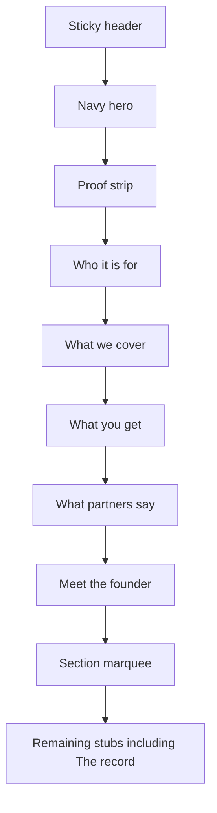

# What partners say — official homepage section

Work only on `Offical-website-v1`. Tokens stay locked to [`app/globals.css`](../../app/globals.css) and [`style-reference.md`](/Users/alexchow/Downloads/Personal%20Folder/Standout%20Group/My%20official%20website/style-reference.md). No new colours, fonts, or radii.

The attached image is the **copy source and skeleton**, not the visual spec. Grey speech-bubble wells, pill tails, and the split “WHAT / partners say” chip are out: they break colour discipline, the 12px rectangle rule, and the quiet law-firm character already used on Who it’s for / What we cover / What you get.

## Locked decisions (confirmed)

| Decision | Choice | Why |
| --- | --- | --- |
| Placement | After What you get, before Meet the founder | Offer first, then partners corroborate, then the founder humanises. |
| Nav | New marquee item `What partners say`. Keep `The record` as a later stub. Header unchanged. | Two destinations stay distinct. Header stays three items + Apply. |
| Visual | Clone What you get 12px white cards | Closest existing recipe. Coherence over the mockup’s grey bubbles. |
| Copy | Wording kept; en-GB dashes + curly apostrophes | Matches `official-copy.ts` (`didn’t`, `it’s`, em dashes). |
| Attribution | Name + specialty only. Two quotes. No photos, logos, stars, or firm names. | Screenshot content; do not invent proof chrome. |
| CTA | None in this band | Header already owns Apply. One primary ask per view. |

## Why not the attached chrome

Style reference locks:

- Plum at a **small number** of points; never a wash, never a second accent (grey quote fills would be a new surface language).
- Geometry is **12px rectangles**, not speech-bubble squircles. The only full pill on the site is the mobile audience chip.
- Personality is quiet enterprise slate, not chat UI.
- New sections must **clone the closest recipe**, not invent a module.

Closest recipe: [`WhatYouGet`](../../components/official/what-you-get.tsx) cards — white fill, `1px` slate-200/80 border, `--radius-md` (12px), hairline `shadow-sm`.

Do **not** use:

- Grey rounded speech bubbles or attribution chips with tails
- Split eyebrow (“WHAT” + pill “partners say”)
- Numbered indexes (`01` / `02`) — that would rank the people
- Star ratings, firm logos, or portrait wells
- A carousel (two quotes should both be visible)
- A second CTA, outline button, or Apply duplicate
- Serif, a second sans, or a new radius
- Plum/extrabold inside the quotes — they are other people’s words, not proof figures

## Copy to implement

Store in [`lib/official-copy.ts`](../../lib/official-copy.ts) as `officialCopy.partners`. Do not hardcode strings in the component.

**Eyebrow:** `What partners say`  
(single plum uppercase line, same as Who it’s for / What we cover / What you get — not a split chip)

**Headline** (one `h2`): `Don’t take our word for it.`

**Quotes:**

| id | Name | Role | Quote (tidied) |
| --- | --- | --- | --- |
| `melissa-roberts` | Melissa Roberts | Conveyancing Law Specialist | Alex didn’t promise a fancy website redesign or a flood of new clients. He proposed diagnosing first, fixing our highest-value law pages, then improving how we captured and tracked enquiries. I agreed to expand only once we could see it working. That phased approach, not a big-bang relaunch, is why we said yes. |
| `brian-kamgue-kargan` | Brian Kamgue-Kargan | Family Law Specialist | I found Alex after he emailed me — an email that described problems I recognised. When he reached out, I didn’t book a call straight away. I looked into them first, the way I’d expect a client to look into us. What got me on the call was that it was framed as a collaboration, not a sales pitch. |

Punctuation deltas vs the screenshot (wording unchanged):

- `didn't` / `I'd` → curly apostrophes
- `emailed me-` → `emailed me —`
- `reached out ,` → `reached out,`

Copy model sketch:

```ts
partners: {
  eyebrow: "What partners say",
  heading: "Don’t take our word for it.",
  items: [
    { id: "melissa-roberts", quote, name, role },
    { id: "brian-kamgue-kargan", quote, name, role },
  ],
}
```

Nav insert, after `what-you-get`:

```ts
{ id: "what-partners-say", label: "What partners say" }
```

Leave `{ id: "the-record", label: "The record" }` in place.

## Layout



**Skeleton (clone What you get cards; do not clone its left-sticky intro):**

What you get sits immediately above this band and already uses a sticky left intro + card grid. Repeating that frame would make two consecutive sections feel identical, and these quotes are long — they need width, not a squeezed right column.

- `section.official-partners#what-partners-say` with `scroll-margin-top: var(--official-header-offset)` and `aria-labelledby`.
- Inner: `.page-shell.official-partners-inner` — same padding rhythm as `.official-get-inner` / `.official-who-inner` (`clamp(2rem, 5vw, 3.5rem)` top, `clamp(2.5rem, 6vw, 4.5rem)` bottom).
- **Intro full-width, left-aligned:** eyebrow → `h2`. Gap `1rem`. Do not sticky. Do not centre. Heading `max-width` ~`28rem` so the short line does not stretch.
- **Cards:** two-up grid. Mobile column stack, gap `1rem`. **768px+:** `repeat(2, minmax(0, 1fr))`. Do not go to three columns at 1100px (there are only two quotes).
- Cards `align-items: stretch` so unequal quote lengths still share one height. Pin the attribution to the foot with `margin-top: auto` on the caption.

**Card internals (one recipe, two instances):**

```
[blockquote quote]
──────── hairline ────────
Name
Role
```

- Outer: clone `.official-get-card` (white, 12px, hairline border, whisper shadow, padding `1.25rem`).
- Quote: `<blockquote><p>` at the What you get body scale. No wrapping `"` characters — the `blockquote` is the quote.
- Caption: hairline `border-top: 1px solid var(--color-line)`, padding-top `1rem`, gap `0.2rem`. Name 700 / `#020617`. Role 400 / `--color-ink-muted`.
- Markup: `<ul>` of two `<li>`s, each a `<figure>` with `blockquote` + `figcaption`. Not an `<ol>` (these are not ranked steps).

**Do not** add a decorative quote-mark well. Trust-card lavender wells belong to the outreach landing; numbering belongs to process/offer. A quiet extra glyph here would be a new motif.

## Type, colour, spacing (locked to existing official scale)

| Element | Match | Size / weight / colour |
| --- | --- | --- |
| Eyebrow | `.official-get-eyebrow` | `0.75rem`, 700, `0.08em`, uppercase, `--color-accent` |
| H2 | `.official-get-heading` | `clamp(1.5rem, 1.1rem + 2vw, 2.25rem)`, 700, `-0.02em`, `#020617` |
| Quote | `.official-get-card-body` | `0.9375rem` → `1.0625rem` md, 400, `1.55`, `--color-ink-muted` |
| Name | `.official-get-card-title` | `1rem` → `1.125rem` md, 700, `#020617` |
| Role | quieter than body | `0.875rem`, 400, `--color-ink-muted` |

Alignment: left, same as Who it’s for / What you get. No centre stack.

## Motion and a11y

- Reuse `motion-enter` / `motion-enter--0` / `--1` on intro + cards. Existing `html.motion-ok` + reduced-motion `0.01ms` rules apply; do not add a new keyframe.
- Semantic quotes: `blockquote` + `figcaption`. Do not add visible quotation marks that AT would double-announce.
- `tabIndex={-1}` on the section for hash jumps, same as Who it’s for.
- Forced-colours: map heading, name, quote, role, card border, and caption rule to `CanvasText` (extend the existing official block).
- No interactive controls in v1. Cards are not links.
- Name is visible text, not a heading (`h3` would imply a new outline entry per person; the section already has one `h2`).

## Files

| File | Change |
| --- | --- |
| [`lib/official-copy.ts`](../../lib/official-copy.ts) | `partners` object; `nav.items` insert `{ id: "what-partners-say", label: "What partners say" }` after `what-you-get`; export `OfficialPartnersItem` |
| [`components/official/what-partners-say.tsx`](../../components/official/what-partners-say.tsx) | New server component. No client JS. |
| [`app/page.tsx`](../../app/page.tsx) | Render `<WhatPartnersSay />` after `<WhatYouGet />`, before `<MeetTheFounder />` |
| [`components/official/section-marquee.tsx`](../../components/official/section-marquee.tsx) | Filter `what-partners-say` out of `OfficialSectionStubs` so the id exists once |
| [`app/globals.css`](../../app/globals.css) | `.official-partners-*` cloned from `.official-get-*` (intro full-width; 2-col from 768px; caption pin); forced-colours |
| [`components/official/site-header.tsx`](../../components/official/site-header.tsx) | **No change** |

## Best-practice notes (do these even if layout tweaks)

1. **Copy in one module.** Same pattern as Who it’s for / What you get. Future quotes should be data, not JSX.
2. **Quotes as quotes.** `blockquote` + `figcaption` is the contract with search and AT. A styled `<p>` is not a testimonial.
3. **Do not carousel two items.** Both voices should be on screen at once on desktop. A slider would hide 50% of the proof and add motion the style reference forbids.
4. **Equal cards, attribution at the foot.** Melissa’s quote is longer. Stretch height and pin the name/role so the band does not look lopsided.
5. **Do not accent inside quotes.** Plum + extrabold is reserved for proof figures (`70%`, `£100K+`, `six figures`). Highlighting words in a partner quote turns their voice into marketing chrome.
6. **Keep “The record” empty.** It stays a stub. Do not merge it with this band, and do not invent case-study UI for it in this pass.
7. **No conversion chrome.** The band is corroboration. Apply stays in the header.
8. **Compliance posture.** These lines describe process and first contact, not guaranteed retained-matter lift. Do not add stars, “results”, or implied SRA-sensitive outcome claims. Publish only with permission already given for name + specialty.
9. **Two is enough.** Do not pad a third empty card to satisfy the outreach landing’s “always three trust cards” rule. That rule is for the conversion landing’s trust module, not this band.
10. **Verify at 390 and 1280.** Sticky header offset on `#what-partners-say`; H2 stays one or two lines; cards stack cleanly; attribution does not collide with the quote; marquee jump; no horizontal clip; reduced-motion kills the fade.

## Out of scope

- Header nav items
- Relocating founder, proof, or What you get
- The record / Why choose us / FAQ / Apply / Contact UI
- Photos, logos, firm names, star ratings
- A third quote or carousel
- A CTA button in this band
- Outreach landing (`components/landing/*`)

## Verify

Desktop and mobile: section sits after What you get and before Meet the founder; type sits below the hero H1 and in line with What you get; mockup speech-bubble chrome is absent; no plum inside quotes; both names/roles visible; marquee “What partners say” jumps clear of the sticky header; `#the-record` still exists as a stub; reduced-motion kills the fade; `#what-partners-say` exists once.
