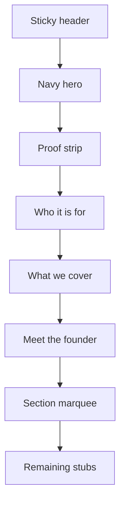

# What we cover — official homepage section

Work only on `Offical-website-v1`. Tokens stay locked to [`app/globals.css`](../../app/globals.css) and [`style-reference.md`](/Users/alexchow/Downloads/Personal%20Folder/Standout%20Group/My%20official%20website/style-reference.md). No new colours, fonts, or radii.

The attached image is the **copy source**, not the visual spec. Lime numbered circles, grey speech-bubble cards, and pill geometry are out: they break colour discipline, the 12px rectangle rule, and the quiet law-firm character already used on Who it’s for / proof / founder.

## Locked decisions

| Decision | Choice | Why |
| --- | --- | --- |
| Placement | After Who it’s for, before founder | Qualify the firm, then show the work. Founder stays a credibility beat. |
| Nav | Marquee only: `What we cover`. Header unchanged. Keep `Why choose us?` as a later stub. | This copy is scope/process, not differentiation. Header is already three items. |
| Steps | 01–03 numbered core; 04 labelled Optional; 05 unnumbered closer | 04 is paid traffic; 05 is a compliance principle; the footnote only covers 1–3. |
| Punctuation | En-GB dashes + curly apostrophes | Matches `official-copy.ts` (`don’t`, `it’s`, em dashes in founder). |
| Markers | Quiet `01`–`03` type, same as Who it’s for `A`/`B`/`C` | Coherence over the mockup’s lime wells. 04 uses `Optional` in the index slot; 05 has none. |
| CTA | None in this band | Header already owns Apply. One primary ask per view. |

## Copy to implement

Store in [`lib/official-copy.ts`](../../lib/official-copy.ts) as `officialCopy.whatWeCover`. Do not hardcode strings in the component.

**Eyebrow:** `What we cover`

**Headline** (two lines, one `h2`):

- `More retained matters.`
- `Fewer enquiries lost along the way.`

**Intro:**

Every unqualified enquiry that reaches a fee-earner is time you’re not billing for. Every qualified one that sits in an inbox overnight is a client calling your competitor instead. Most firms don’t have a lead problem — they have a handling problem, and it’s costing six figures a year without anyone seeing exactly where. Here’s how we close the gap.

**Core steps** (`role: "core"`, numbered 01–03):

| Index | Title | Body |
| --- | --- | --- |
| 01 | Find the fit | We start with your market: your target clients, your strongest practice areas, and where competitors are winning enquiries that should be yours. Everything after this is built on what we find, not a template. |
| 02 | Fix the front door | Landing pages built to convert, and enquiry forms that ask the right questions upfront — so your team spends less time chasing details and more time on cases worth taking. |
| 03 | Handle what happens next | Personal follow-up emails, lead qualification, and — where it earns its place — a chatbot that catches enquiries out of hours before they go cold. All of it feeding your existing CRM, so nothing falls through. |

**Footnote** (sits immediately after 03, before 04): `Steps 1–3 run inside your free 30-day pilot.`

**Optional step** (`role: "optional"`):

| Index slot | Title | Body |
| --- | --- | --- |
| Optional | Fill the funnel | For firms who want traffic handled too, we manage Google Ads, Meta Ads, content and social — so the people landing on your site are already a good fit for what you do. |

**Closer** (`role: "principle"`, no index):

**Built for legal, not bolted on.** Legal marketing runs on rules general marketing doesn’t. Every page, form and follow-up sequence we build is designed around SRA/BSB compliance and GDPR from the start, not added afterward as a disclaimer at the bottom of the page.

Copy model sketch:

```ts
whatWeCover: {
  eyebrow, heading, headingAccent, intro, introAccentPhrase: "six figures",
  steps: [ { id, index, title, body, role: "core" }, … ],
  optional: { id, kicker: "Optional", title, body },
  principle: { id, title, body },
  footnote,
}
```

### Accent treatment

Do **not** extrabold the whole intro. Follow the founder/proof rule: plum + `font-extrabold` only on a proof phrase.

- Wrap **six figures** in the intro with `--color-accent` + `font-extrabold` (same helper as [`proof-strip.tsx`](../../components/official/proof-strip.tsx)).
- Do **not** accent `30-day`, `SRA/BSB`, or `GDPR` — those are constraints, not proof figures, and the founder plan already reserved plum for sparse branded points.

## Why not the attached skeleton

Style reference locks:

- Plum at a **small number** of points; never a wash, never a second accent (lime is a new colour).
- Geometry is **12px rectangles**, not circles. The only full pill on the site is the mobile audience chip.
- Personality is quiet enterprise slate, not startup timeline chrome.
- New sections must **clone the closest recipe**, not invent a module.

Closest recipe: [`WhoItsFor`](../../components/official/who-its-for.tsx) — light canvas, plum uppercase eyebrow, left intro, hairline list with quiet indexes.

Do not use:

- Lime / yellow / green markers
- Grey rounded speech bubbles behind titles or intro
- A decorative vertical spine unless it is a 1px `--color-line` (and even then, prefer the existing hairline row rules)
- A second CTA, outline button, or Apply duplicate
- Serif, a second sans, or a new radius

## Layout



**Skeleton (clone Who it’s for, then group the process):**

- `section.official-cover#what-we-cover` with `scroll-margin-top: var(--official-header-offset)` and `aria-labelledby`.
- Inner: `.page-shell.official-cover-inner` — same padding rhythm as `.official-who-inner` (`clamp(2rem, 5vw, 3.5rem)` top, `clamp(2.5rem, 6vw, 4.5rem)` bottom).
- **Mobile:** column stack, left-aligned, gap `2rem`.
- **Desktop (768px+):** same 2-column grid as Who it’s for (`0.9fr` intro / `1.1fr` list). The right column is still tall (3 steps + footnote + optional + closer), so make `.official-cover-intro` `position: sticky; top: calc(var(--official-header-offset) + 1rem)` on `md+` only. Sticky is layout, not animation; leave it on under reduced motion.
- Intro column: eyebrow → `h2` (two stacked lines) → intro paragraph.
- Right column, in this order:
  1. `<ol>` of three core steps
  2. Footnote
  3. Optional 04 row
  4. Unnumbered 05 closer

**Headline split:** two `<span class="official-cover-heading-line">` inside one `h2`, not two headings. `text-wrap: balance` on the block. Do not cap `max-width` as tight as Who it’s for’s `22rem` — this title is two short sentences; allow ~`28rem` so it does not stack to four lines.

**Core rows:** clone `.official-who-item` — `1.75rem` index column, hairline top/bottom `--color-line`, padding `1.25rem` / `1.5rem` md. Index `01`–`03` (`aria-hidden`; the `<ol>` already exposes order). Title `h3`, body `p`.

**Footnote:** a `p` immediately after the `ol`, before 04. Size ~`0.875rem`, weight 500, `--color-ink-muted`. Hairline above. No button. No `#apply` link in v1.

**Optional 04:** same two-column row as a core step, but the index slot is the word `Optional` (same type as `.official-who-index` — `0.75rem`, 700, uppercase, `0.08em`, `--color-ink-quiet`). Not plum, not a badge, not a new colour. Slightly quieter body is optional; default is the same body colour so it stays readable. Markup: a `div` or second list, **not** a fourth `<li>` in the core `ol`, so AT does not count it as step 4 of the pilot.

**Closer 05:** full-width of the right column, no index column. Hairline separator, then `h3` + `p` using the same title/body scale. Extra top padding (`1.5rem` / `2rem` md) so it reads as a principle, not a sixth row. Do not put it in the `ol`.

**Do not** sticky the intro on small screens.

## Type, colour, spacing (locked to existing official scale)

| Element | Match | Size / weight / colour |
| --- | --- | --- |
| Eyebrow | `.official-who-eyebrow` | `0.75rem`, 700, `0.08em`, uppercase, `--color-accent` |
| H2 | `.official-who-heading` | `clamp(1.5rem, 1.1rem + 2vw, 2.25rem)`, 700, `-0.02em`, `#020617` |
| Intro | founder body / who item body — **not** the 600 supporting line | `0.9375rem` → `1.0625rem` md, 400, `1.55`/`1.6`, `--color-ink-muted` |
| Step index / Optional kicker | `.official-who-index` | `0.75rem`, 700, `0.08em`, `--color-ink-quiet` |
| Step title / closer title | `.official-who-item-title` | `1rem` → `1.125rem` md, 700, `#020617` |
| Step body / closer body | `.official-who-item-body` | `0.9375rem` → `1.0625rem` md, 400, `--color-ink-muted` |
| Footnote | quieter than body | `0.875rem`, 500, `--color-ink-muted` |

Intro is a paragraph, so it stays 400. Using 600 here would compete with the H2 and with Who it’s for’s short supporting line.

Alignment: left, same as Who it’s for and the navy hero copy. No centre stack.

## Motion and a11y

- Reuse `motion-enter` / `motion-enter--0`…`--3` on intro + first steps, or `[data-reveal]` with `--reveal-index` on the `ol` children. Existing `html.motion-ok` + reduced-motion `0.01ms` rules apply; do not add a new keyframe.
- Semantic `<ol>` of **three** core steps only. 04 and 05 live outside it so the list matches the pilot footnote.
- Do not duplicate `01`–`03` in accessible text (`aria-hidden` on the visual index).
- `tabIndex={-1}` on the section for hash jumps, same as Who it’s for.
- Forced-colours: map heading, indexes, optional kicker, closer, and borders to `CanvasText` (extend the existing official block).
- No interactive controls in v1.

## Files

| File | Change |
| --- | --- |
| [`lib/official-copy.ts`](../../lib/official-copy.ts) | `whatWeCover` object (core / optional / principle / footnote); `nav.items` insert `{ id: "what-we-cover", label: "What we cover" }` after `who-its-for` |
| [`components/official/what-we-cover.tsx`](../../components/official/what-we-cover.tsx) | New server component. CSS sticky only — no client JS. |
| [`app/page.tsx`](../../app/page.tsx) | Render `<WhatWeCover />` after `<WhoItsFor />`, before `<MeetTheFounder />` |
| [`components/official/section-marquee.tsx`](../../components/official/section-marquee.tsx) | Filter `what-we-cover` out of `OfficialSectionStubs` so the id exists once |
| [`app/globals.css`](../../app/globals.css) | `.official-cover-*` cloned from `.official-who-*`; sticky intro; footnote; optional row; closer; forced-colours |
| [`components/official/site-header.tsx`](../../components/official/site-header.tsx) | **No change** |

## Best-practice notes (do these even if layout tweaks)

1. **Copy in one module.** Same pattern as Who it’s for / founder. Future edits should not hunt through JSX.
2. **Process as an ordered list of three.** Search, AT, and the footnote (“Steps 1–3”) must agree. 04/05 stay outside the `ol`.
3. **Do not fork a second list language.** Quiet indexes beat a custom timeline. Upgrade path later, if needed: lavender 12px wells cloned from trust-card icon wells — still not circles, still not lime.
4. **Keep 04 honest.** `Optional` in the index slot, quiet ink, no badge colour, not counted as a pilot step.
5. **05 is a principle.** Unnumbered closer, no lock icon, no fifth index.
6. **Footnote after 03.** That is where the pilot claim is true. Putting it under 05 would imply 04/05 are in the trial.
7. **No conversion chrome.** The band explains scope. Apply stays in the header.
8. **Measure the intro.** Long paragraph at 400 on `--measure` (36rem) in the left column; do not let it span 72rem on desktop.
9. **Verify at 390 and 1280.** Sticky header offset on `#what-we-cover`; two-line H2; 02/03 titles wrap; sticky intro does not cover the list at 768px; footnote sits after 03; marquee jump; no horizontal clip.

## Out of scope

- Header nav items
- Relocating founder or proof
- Why choose us / FAQ / The record / Apply / Contact UI
- Icons, illustrations, or a chatbot screenshot
- A CTA button in this band
- Outreach landing (`components/landing/*`)

## Verify

Desktop and mobile: section sits after Who it’s for; type sits below the hero H1 and in line with Who it’s for; lime/grey mockup chrome is absent; `six figures` is the only plum phrase; 04 reads as optional; 05 has no number; footnote sits after step 03; marquee “What we cover” jumps clear of the sticky header; reduced-motion kills the fade; `#what-we-cover` exists once.
